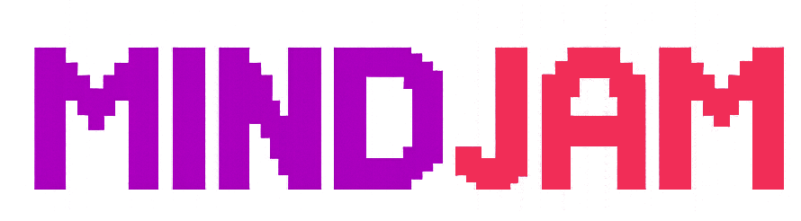

  

    <pre id="boot-text"></pre>
  

  

    <h1>Salesforce Training Guide</h1>

    

      Welcome to the <strong>MindJam Salesforce Training Guide</strong>.
    

    

      This guide introduces the key information you need to use the <strong>Salesforce Community</strong>
      site to manage and run your mentoring sessions.
    

    

      The guide is organised into clear sections. We recommend following them in chronological order,
      as each section builds on the previous one and will help you set up your account step by step.
    

    

      If you prefer, a <a href="assets/PDFs/Salesforce_Training_Guide_Print_Edition.pdf" target="_blank" rel="noopener"><strong>separate overview guide</strong></a> is also available. This allows you to
      explore the features in a more flexible way without following the step-by-step order.
    

    

      <a
        id="retro-start-here"
        class="retro-button retro-section-nav__link retro-button-pulse retro-nav-button"
        href="/but-why/"
        data-target="/but-why/"
        data-transition-title="=== NEXT LEVEL ==="
        data-transition-page="But Why"
      >
        Start Here
      </a>
    

    

      
    

  

  

    

    

    
System Ready

  

  

    

    

    

    

    

    

      
System Transfer

      
Loading Next Level...

    

  

